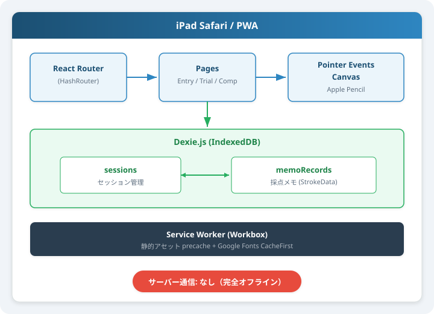
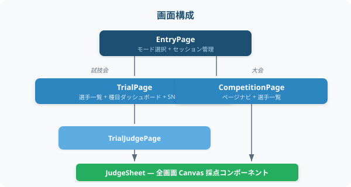

# MAG Judge Memo

体操競技男子（MAG: Men's Artistic Gymnastics）審判向けの採点メモ Web アプリ。
iPad + Apple Pencil での利用に最適化した PWA。

> **Live App:** [https://kaito-imadu.github.io/MAG-judge-memo/](https://kaito-imadu.github.io/MAG-judge-memo/)

---

## PWA としてインストールする方法

本アプリはPWA（Progressive Web App）対応で、ホーム画面に追加するとネイティブアプリのように動作します。**Wi-Fi がない体育館でも完全オフラインで使えます。**

### iPad / iPhone（Safari）

1. Safari で [https://kaito-imadu.github.io/MAG-judge-memo/](https://kaito-imadu.github.io/MAG-judge-memo/) を開く
2. 画面下部（または上部）の **共有ボタン**（□↑）をタップ
3. **「ホーム画面に追加」** をタップ
4. 名前を確認して **「追加」** をタップ
5. ホーム画面に「MAG Memo」アイコンが追加される

> **ポイント:**
> - インストール後はアドレスバーなしのフルスクリーンで起動します
> - 横向き（Landscape）に最適化されたレイアウトで表示されます
> - Apple Pencil で手書き、指でUI操作（パームリジェクション対応）
> - 一度ページを開けば、以降はオフラインで動作します（Service Worker がアセットをキャッシュ）

### Android（Chrome）

1. Chrome で上記 URL を開く
2. アドレスバーの **「インストール」** バナー、またはメニュー（⋮）→ **「アプリをインストール」** をタップ
3. ホーム画面にアイコンが追加される

### PC（Chrome / Edge）

1. ブラウザで上記 URL を開く
2. アドレスバー右端の **インストールアイコン**（⊕）をクリック
3. 「インストール」を確認

### オフライン動作について

- 初回アクセス時に Service Worker が全ての静的アセット（HTML/CSS/JS）と Google Fonts をキャッシュします
- 2回目以降はネットワーク接続なしで完全に動作します
- 採点データはすべて端末内の IndexedDB に保存されるため、サーバー通信は一切不要です
- アプリが更新された場合、次回オンライン時に自動で最新版に更新されます

---

## 機能

### 2つのモード

| モード | 用途 | 説明 |
|--------|------|------|
| **試技会モード** | 練習・試技会 | 選手ごとに全6種目の採点メモを管理。選手を登録し、種目を選んで採点 |
| **大会モード** | 公式大会 | 種目固定で選手を次々と採点。ページ送りで選手を切り替え |

### 試技会モード

- 選手を追加・削除して管理
- 選手を選択 → 6種目（FX/PH/SR/VT/PB/HB）から種目をタップして採点画面へ
- 採点済みの種目には「済」マークが表示
- **採点結果を共有**: 選手の全6種目の採点メモを1枚のPNG画像にまとめてSNS共有・ダウンロード
  - iOS では Web Share API で直接 LINE / AirDrop 等に共有可能

### 大会モード

- セッション作成時に種目を1つ選択（例: FX）
- 画面上部に種目名と選手名/番号の手書き記入枠を表示
- 「次の選手」ボタンで新しいページを追加
- 「一覧」ボタンで全ページのサムネイルプレビューをグリッド表示
  - 各ページの手書きメモが縮小表示され、採点状況を一目で確認可能
  - タップで任意のページにジャンプ

### 採点画面（共通）

| 機能 | 説明 |
|------|------|
| **手書きメモ** | Apple Pencil 対応の全画面キャンバス。3色ペン（黒/赤/青）切替 |
| **消しゴム** | 消しゴムモードONでストロークをなぞって削除。アイコン付きトグルボタン |
| **Undo / Redo** | 直前の操作を取り消し・やり直し |
| **全消去** | 現在のページの全ストロークを一括削除 |
| **直線モード** | ペンを長押し（1.5秒）で自動的に直線描画に切り替え |
| **スクラブ消去** | ストローク上を素早く左右にこすって削除（消しゴムモード不要） |
| **テンプレート** | D/Eスコア欄、ND項目、CV欄が種目に応じて背景に表示。ゆかはCTV（Corner Transition Variation）11項目のチェックリストも表示 |
| **自動保存** | 描画内容は自動で IndexedDB に保存（1.5秒デバウンス + 画面離脱時即保存） |

### 対応種目（MAG 全6種目）

FX（ゆか）/ PH（あん馬）/ SR（つり輪）/ VT（跳馬）/ PB（平行棒）/ HB（鉄棒）

種目ごとにテンプレート（スコア欄・ND項目・CV欄）が自動で切り替わります。ゆかではND項目の上に**Corner Transition Variation** チェックリスト（Steps / Scissor kick / Cartwheel / Split jump / Handstand / Stag Leap / Kneeling / Front support ほか 全11項目）を表示し、コーナーでの動きの重複チェックをサポートします。

---

## 技術スタック

| レイヤー | 技術 |
|----------|------|
| フレームワーク | React 19 + TypeScript 5.9 (strict) |
| ビルド | Vite 8 |
| スタイリング | Tailwind CSS 4 |
| ローカルDB | Dexie.js 4 (IndexedDB) |
| ルーティング | React Router v7 (HashRouter) |
| 手書き入力 | HTML5 Canvas 2層構造 + Pointer Events API + getCoalescedEvents + desynchronized |
| PWA | vite-plugin-pwa (Workbox) |
| デプロイ | GitHub Pages (GitHub Actions) |

---

## アーキテクチャ

<p align="center">
  
</p>

### 画面構成

<p align="center">
  
</p>

---

## セットアップ（開発者向け）

```bash
# クローン
git clone https://github.com/Kaito-Imadu/MAG-judge-memo.git
cd MAG-judge-memo

# 依存関係インストール
npm install

# 開発サーバー起動
npm run dev

# ビルド
npm run build

# ビルドプレビュー
npm run preview

# 型チェック
npx tsc --noEmit

# ESLint
npm run lint

# PWAアイコン再生成
node scripts/generate-icons.mjs
```

---

## ディレクトリ構成

```
src/
├── main.tsx              # エントリーポイント + SW登録
├── App.tsx               # ルーティング定義 (HashRouter)
├── index.css             # Tailwind エントリー + テーマ変数
├── pages/
│   ├── EntryPage.tsx     # モード選択・セッション管理
│   ├── TrialPage.tsx     # 試技会モード（選手×種目）
│   ├── TrialJudgePage.tsx # 試技会 採点画面ラッパー
│   └── CompetitionPage.tsx # 大会モード（ページ制）
├── components/
│   └── JudgeSheet.tsx    # メイン採点コンポーネント（Canvas）
├── db/
│   └── database.ts       # Dexie DB定義 (sessions, memoRecords)
├── types/
│   └── index.ts          # TypeScript 型定義
├── constants/
│   ├── apparatus.ts      # 6種目定義 + ND種別マッピング
│   └── deductions.ts     # E審判減点値 + ND定義
├── utils/
│   └── exportSheet.ts    # PNG画像エクスポート + SNS共有
└── hooks/                # カスタムフック
```

---

## 参考資料

| 資料 | 用途 |
|------|------|
| [FIG Code of Points MAG 2025-2028](https://www.gymnastics.sport/site/rules/) | 採点ルール・減点体系・ND定義の根拠 |
| [Dexie.js Documentation](https://dexie.org/) | IndexedDB ラッパーの API リファレンス |
| [Pointer Events API (MDN)](https://developer.mozilla.org/en-US/docs/Web/API/Pointer_events) | Apple Pencil の筆圧・pointerType 判定 |
| [Workbox (Google)](https://developer.chrome.com/docs/workbox/) | Service Worker によるオフラインキャッシュ戦略 |

---

## ライセンス

MIT
